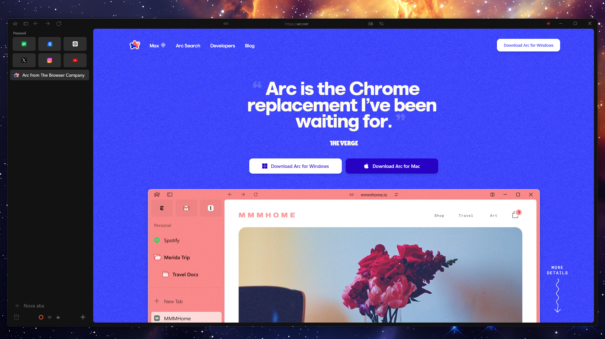
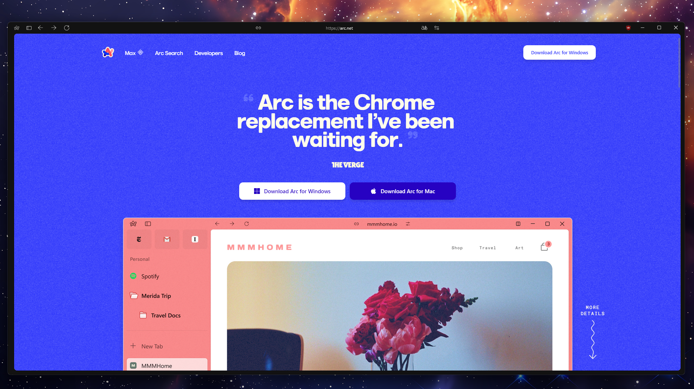
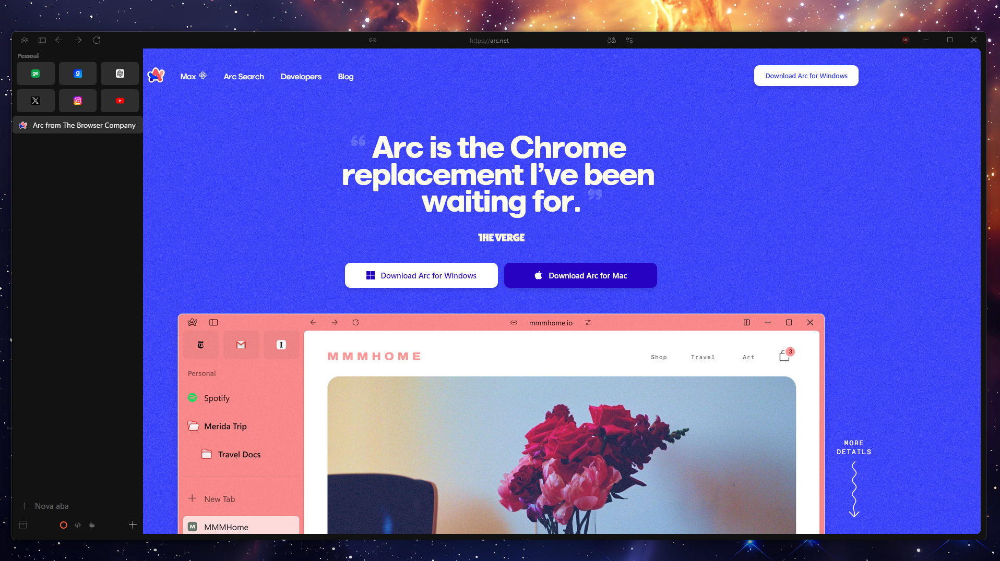
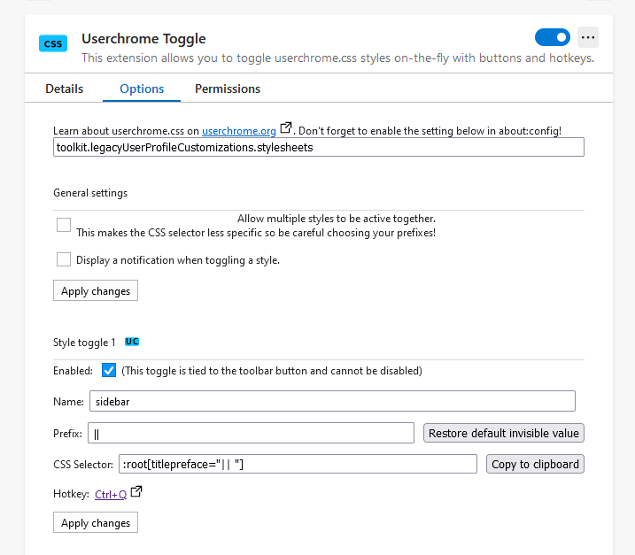
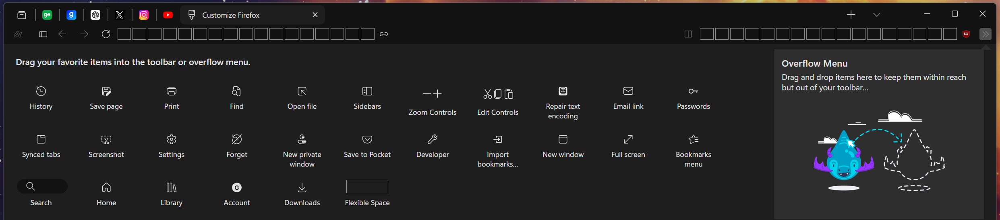
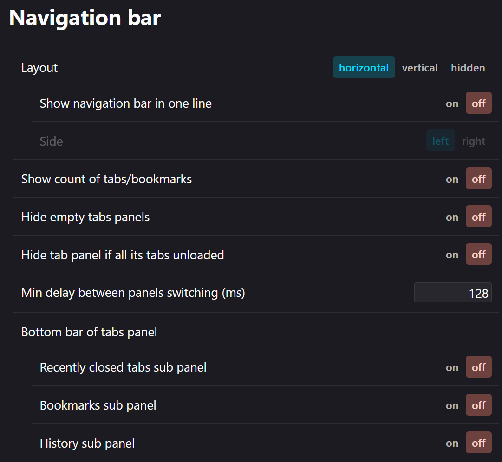
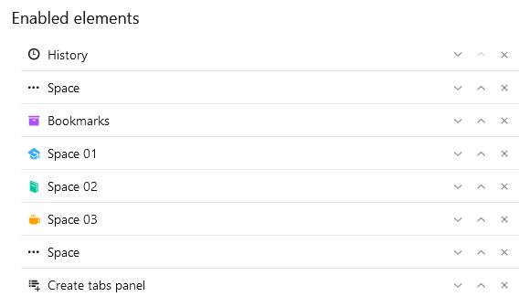

# ArcWTF-Mods
This project is just a complement for original project [Arc WTF](https://github.com/KiKaraage/ArcWTF), with a simplified tutorial and some small adjustments and tweaks.

**All credits goes to [KiKaraage](https://github.com/KiKaraage) and [Arc WTF](https://github.com/KiKaraage/ArcWTF)**

## P.S
1. This mod try to adapt the look from Windows version of Arc Browser
2. This mod has some conflicts with split views extensions and Floop browser

## Screenshots
### Sidebar default


### Sidebar closed


### Sidebar with autohide


## Step 1 - Sidebery configuration
### Install Extension
- [Sidebery](https://github.com/mbnuqw/sidebery)

### Configuration
##### JSON
In this step you will upload the configurations file for Sidebery. This file contains the structure for "spaces" and pinned tabs
1. Open `about:addons`, click in the 3 dots on 'Sidebery' extension and click in 'Options'
2. Under 'Settings' section, go to 'Help'
   1. Download the configuration file: [Sidebery JSON](https://github.com/KiKaraage/ArcWTF/blob/main/sidebery-ArcWTF.json)
   2. Select `Import Addon Data` and upload the downloaded file 

##### CSS
Now, you need to download and configure the stylization files
1. Download or clone the ArcWtf repo - [Download] (https://github.com/KiKaraage/ArcWTF/archive/refs/heads/main.zip)
2. In Firefox, go to `about:profiles`
3. Go to section 'Root Directory' and click 'Open Folder'/'Show in Finder'
4. In your file explorer, create a new folder 'chrome'
5. Extract the downloaded file inside 'chrome' folder (Check if all files are in the root folder). 
6. Go to `about:config`, paste `toolkit.legacyUserProfileCustomizations.stylesheets` into the bar and set its value to true/choose Boolean and click + (plus) icon.
7. After that, paste `svg.context-properties.content.enabled` into the bar and set its value to true/choose Boolean and click + (plus) icon.
8. Restart Firefox

## Step 2 - Toggle button
In this step you will add the toggle button to open/close the sidebar

### Install Extension
- [Userchrome Toggle](https://addons.mozilla.org/pt-BR/firefox/addon/userchrome-toggle/).

1. Open `about:addons`, click 'Userchrome Toggle', go to 'Options' tab.
2. In the 'Options' tab, disable `Display a notification` checkbox,
3. Now, go to 'Style Toggle 1' section and put `|| ` in Prefix input (should also have the ending space) and click on Apply Changes.
4. **P.S - The page has multiple `Apply Changes` buttons, check if you applied correctly for "General Settings" and "Style toggle 1" sections. If not applied correctly the toggle for sidebar will not work**

##### Screenshot options tab


#### Pin toggle extension on toolbar
1. Click extension button (split icon on right side of toolbar)
2. Right click on `Userchrome Toggle icon`
3. Click 'Pin to Toolbar'

## Step 3 - Toolbar Visual

### Copy button on toolbar
##### Install Extension
- [Copy Frame or page Url](https://addons.mozilla.org/pt-BR/firefox/addon/copy-frame-or-page-url/)

##### Pin copy button extension on toolbar
1. Click extension button (split icon on right side of toolbar)
2. Right click on `Copy Current Page`
3. Click 'Pin to Toolbar'.

### Icons placement
Right-click navigation toolbar and click 'Customize Toolbar'

In this new tab, you will just move every buttons to the right place

Move: 
1. Copy button
   1. Move the `Copy Button icon` to the left of address bar
2. Extension Button
   1.Move the `Extension button` to the right of address bar 
3. Sidebar toggle
   1. Move the `Userchrome Toggle icon` to the left position, before back-forward-reload buttons
   2. Use this button to toggle sidebar
4. Remove the download button (optional)
5. Use the flexible spaces and put then before and after the address bar

#### Screenshot of toolbar edit


### Change extension button icon
1. In Firefox, go to `about:profiles`
2. Check 'Root Directory' and click 'Open Folder'/'Show in Finder'
3. Open the folder 'chrome'
4. Open `userChrome.css` file and past this code at the end:
```
/* Transform extension logo button */
#add-ons-button,
#appMenu-extensions-themes-button,
#unified-extensions-button {
    list-style-image: url("./icons/permissions.svg") !important;
}
```

## Step 4 - Sidebar Visual
Go to Sidebery settings 
1. Under "Navigation Bar" section:
   1. Update in this way:
   
   2. In this section you can organize your spaces icons and name 
      

2. Under "Context Menu" section:
   1. Enable:
      1. Use native context menu
      2. Render inactive options
      3. Render Icons

## Step 5 - Themes
You can use any theme from Firefox Store

For this mod i'm using:
- [Perfect Dark Theme](https://addons.mozilla.org/pt-BR/firefox/addon/perfectdarktheme/)

## Step 6 - Tweaks
Open `about:config`
### Arc behaviors
| Behavior                                               |                         Flag                         |  Value |
|:-------------------------------------------------------|:----------------------------------------------------:|-------:|
| Floating search bar                                    |               `uc.tweak.popup-search`                |   true |
| Prevent pinned tabs to load on browser startup         | `browser.sessionstore.restore_pinned_tabs_on_demand` |   true |
| Prevent background tabs to load when they are sleeping |       `browser.sessionstore.restore_on_demand`       |   true |
| Prevent browser to close when close last tab           |        `browser.tabs.closeWindowWithLastTab`         |  false |
| Extend sidebar size / 4 pinned tabs per lne            |              `uc.tweak.longer-sidebar`               |   true |

### Visual improvements
| Behavior                                               |                          Flag                          | Value |
|:-------------------------------------------------------|:------------------------------------------------------:|------:|
| Best font and icons resolution                         |  `gfx.font_rendering.cleartype_params.rendering_mode`  |     5 |
| Zoom scale                                             |              `layout.css.devPixelsPerPx`               |     1 |

### CSS - Optional
1. In Firefox, go to `about:profiles`
2. Check 'Root Directory' and click 'Open Folder'/'Show in Finder'
3. Open the folder 'chrome'
4. Open `userChrome.css` file and past:

###### Remove identity/padlock button from address bar
```
/* Remove identity/padlock button */
#identity-box:not(:hover) {
    width: 1px !important;
    min-width: 1px !important;
    padding-left: 0px !important;
    padding-right: 0px !important;
    transition: all 200ms ease-in-out !important;
    opacity:  0 !important;
}

#identity-box:hover {
    width: calc(var(--urlbar-min-height) - 2px /* border */ - 2 * var(--urlbar-container-padding)) !important;
    min-width: unset !important;
    transition: all 200ms ease-in-out !important;
    opacity:  1 !important;
}
```
##### Remove tracking button from address bar
```
/* Remove tracking button */
#tracking-protection-icon-box {
    display: none;
}
```
##### Remove bookmarks (star) button from address bar
```
/* Remove bookmarks button */
#star-button-box {display: none !important;}
```

##### "New Tab" text on sidebar
1. Go to Extensions > Sidebery > 3 dots > Options > Styles Editor
2. Search for ".TabsPanel .new-tab-btn:after" 
3. Change the value of "content" parameter to your language. In PT-BR i'm using "Nova aba" as text
